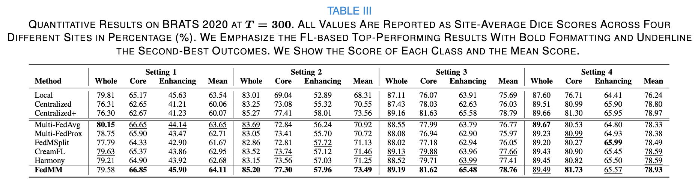

# Tackling Modality-Heterogeneous Client Drift Holistically for Heterogeneous Multimodal Federated Learning

## Introduction

This is the official release of the paper **Tackling Modality-Heterogeneous Client Drift Holistically for Heterogeneous Multimodal Federated Learning**, along with the network implementation and training scripts.

> [**Tackling Modality-Heterogeneous Client Drift Holistically for Heterogeneous Multimodal Federated Learning**](https://ieeexplore.ieee.org/document/10816602),
>
> **Haoyue Song, Jiacheng Wang**, Jianjun Zhou, Liansheng Wang
>
> In: IEEE Transactions on Medical Imaging, 2025

## Usage

#### Dataset 

In this paper, we perform the experiments using three public medical datasets, including [BRATS 2020](https://www.med.upenn.edu/cbica/brats2020/data.html), [MSWML 2022](https://shifts.grand-challenge.org), and [ABCs](https://abcs.mgh.harvard.edu). You may also get BRATS 2020 [here]( get dataset BRATS2020 here (https://drive.google.com/drive/folders/1AwLwGgEBQwesIDTlWpubbwqxxd8brt5A?usp=sharing) and unzip it [tar -xzf BRATS2020_Training_none_npy.tar.gz]).

#### Training

Run the train script `$ bash exps/exp-fed.sh`

#### Testing 

Run the test script `$ bash exps/exp-test.sh`

#### Results

